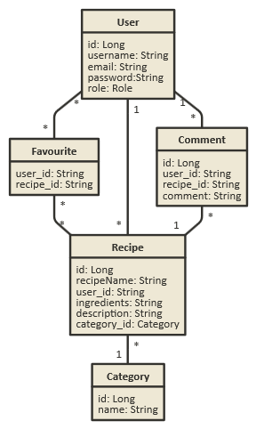
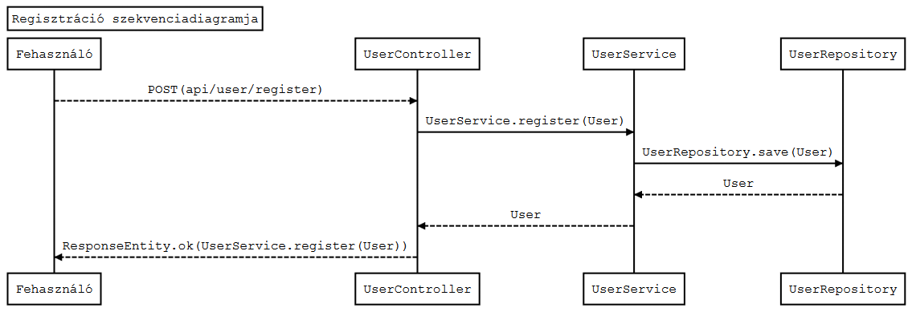
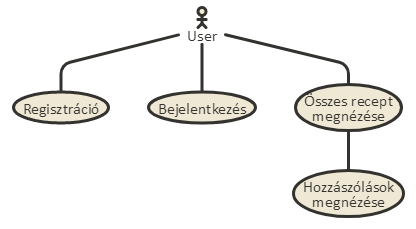
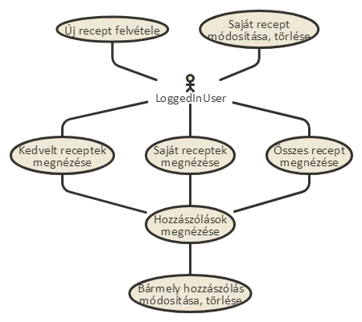
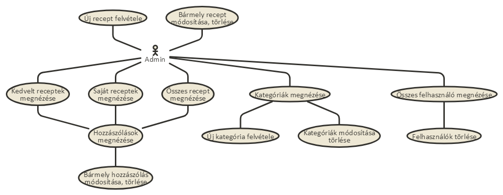
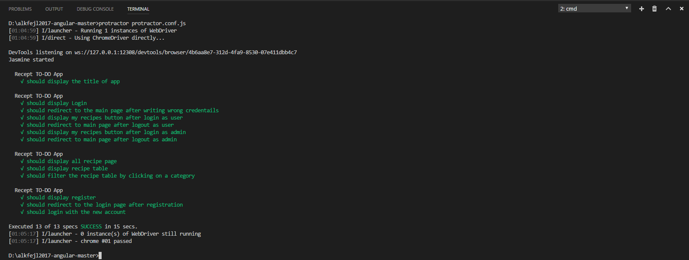

# Alkalmazások fejlesztése projekt: Recept TO-DO

A projekt célja egy receptek feltöltésére használható webes alkalmazás elkészítése.

## 1. Projektötlet

### 1.1 Funkcionális Követelmények:

**Minden felhasználóra** vonatkozóan:

* Regisztráció
* Bejelentkezés
* Kijelentkezés
* Recept kedvencekhez adása
* Kedvencekből recept törlése
* Receptek létrehozása
* Receptek törlése
* hozzászólás a receptekhez
* hozzászólás szerkesztése, törlése

**Adminisztrátor(ok)ra** vonatkozóan:

* Bármely felhasználó receptjeinek módosítása
* Bármely felhasználó receptjeinek törlése
* Bármely felhasználó hozzászólásának módosítása
* Bármely felhasználó hozzászólásának törlése
* Bármely felhasználó törlése
* Recept kedvencekhez adása
* Kedvencekből recept törlése
* Receptek létrehozása
* Receptek törlése
* Kategória létrehozása
* Kategória módosítása
* Kategória törlése

### 1.2 Nem Funkcionális Követelmények:

- Biztonság:
  - jelszavak hashelése

##
- Kezelhetőség:
  - csak a felhasználó részére érdekes dolgok jelennek meg
  - Intuitív felhasználói felület

### 1.3 Szakmai Fogalmak:

* **Kategória:** Egy recept kategóriája pl: Leves,Pizza,Tésztaétel
* **Recept:** Egy kategóriába besorolható étel.
* **Hozzávaló:** Egy recept elkészítéséhez való hozzávaló pl: Só,cukor,liszt

* Recept felépítése:
  - Kategória
  - Felhasználó aki feltöltötte
  - Hozzávaló (több is lehet)
  - Leírás
  - Hozzászólások

### 1.4 Szerepkörök

* **Adminisztrátor:** Kezeli a kategóriákat, ellenőrzi a recepteket, hozzászólásokat, ha baj van velük törölheti őket.
* **Felhasználó:** Feltölthet új recepteket, sajátjait módosíthatja, törölheti, illetve hozzászólhat, a saját hozzászólásait törölheti, módosíthatja.
* **Nem bejelentkezett felhasználó:** Böngészheti a recepteket, elolvashatja a hozzászólásokat.

## 2. Backend megvalósítása

### 2.1 Fejlesztői környezet

#### Felhasznált eszközök

* [Git](https://git-scm.com/) verziókezelő
* [Java](https://www.java.com/) [Spring Boot](https://projects.spring.io/spring-boot/) technológia használata
* [H2](http://www.h2database.com/) adatbázis használata
* [MAVEN](https://maven.apache.org/) a projekt menedzseléséhez és a build folyamat automatizálásához
* [Github](https://github.com/) a projekt közzétételéhez

#### Fejlesztőkörnyezet felállítása

1. [Git](https://git-scm.com/) verziókezelő telepítése  
   *A [Githubon](https://github.com/) történő regisztráció ajánlott!*
2. Projekt klónozása lokális gépre: `git clone https://github.com/pkovacs1991/alkfejl2017.git`
3. A projektkönyvtárban a [Spring Boot](https://projects.spring.io/spring-boot/) függőségek beállítása: `pom.xml`
   ```xml
   <?xml version="1.0" encoding="UTF-8"?>
   <project xmlns="http://maven.apache.org/POM/4.0.0" xmlns:xsi="http://www.w3.org/2001/XMLSchema-instance"
	xsi:schemaLocation="http://maven.apache.org/POM/4.0.0 http://maven.apache.org/xsd/maven-4.0.0.xsd">
	<modelVersion>4.0.0</modelVersion>

	<groupId>org.springframework</groupId>
	<artifactId>name-of-the-app</artifactId>
	<version>0.1.0</version>

	<properties>
		<java.version>1.8</java.version>
	</properties>

	<parent>
		<groupId>org.springframework.boot</groupId>
		<artifactId>spring-boot-starter-parent</artifactId>
		<version>1.5.6.RELEASE</version>
	</parent>

	<dependencies>
		<dependency>
			<groupId>org.springframework.boot</groupId>
			<artifactId>spring-boot-starter-web</artifactId>
		</dependency>
	</dependencies>

	<build>
		<plugins>
			<plugin>
				<groupId>org.springframework.boot</groupId>
				<artifactId>spring-boot-maven-plugin</artifactId>
			</plugin>
		</plugins>
	</build>

   </project>
   ```
4. Adatbázis felépítése példaadatokkal az `import.sql` fájlban.  
   pl: `INSERT INTO USER (username,email,password,role) VALUES ('alma','a@a.com','aaa','ADMIN');`  
   *(Fontos ezt beállítani, ugyanis a H2 adatbázis csak a memóriában tárol az adatokat. Enélkül üres tábláink lennének!)*
5. App indítása: `pom.xml` jobb klikk -> `Run Maven...` -> `Goals: spring-boot:run`  
   vagy parancssorból: `mvn spring-boot:run`
6. Ezek után a `http://localhost:8080/` címen el tudjuk érni a szerverünket

### 2.2 Adatbázis-terv



### 2.3 Könyvtárstruktúra

- main
  - java
    - recipes
      - config
	    - `AuthInterceptor.java`
      - controller
	    - `CategoryController.java`
		- `CommentController.java`
		- `RecipeController.java`
		- `UserController.java`
      - entity
	    - `Category.java`
		- `Comment.java`
		- `Recipe.java`
		- `User.java`
      - repository
	    - `CategoryRepository.java`
		- `CommentRepository.java`
		- `RecipeRepository.java`
		- `UserRepository.java`
      - service
	    - annotation
		  - `Role.java`
		- exception
		  - `NotFoundException.java`
		  - `NotOwnCommentException.java`
		  - `NotOwnRecipeException.java`
		  - `UserNotValidException.java`
	    - `CategoryService.java`
		- `CommentService.java`
		- `RecipeService.java`
		- `UserService.java`
      - `Application.java`
  - resources
    - `application.properties`
	- `import.sql`

### 2.4 Végpontok

#### user

- `GET /api/user` : Saját felhasználói fiók elérése
- `GET /api/user/login` : Bejelentkezés
- `GET /api/user/logout`: Kijelentkezés
- `POST /api/user/register` : Regisztráció
- `DELETE /api/user/{id}` : Felhasználó törlése

#### Recipe

- `GET /api/recipes` : Az összes recept lekérdezése
- `GET /api/recipes/my` : Saját receptek lekérdezése
- `GET /api/recipes/{id}` : Egy recept lekérdezése
- `POST /api/recipes` : Recept létrehozása
- `POST /api/recipes/favourites/{id}` : Recept hozzáadása a kedvencek közé
- `PUT /api/recipes/{id}` : Recept módosítása
- `DELETE /api/recipes/{id}` : Recept törlése
- `DELETE /api/recipes/favourites/{id}` : Recept törlése a kedvencek közül

#### Category

- `GET /api/category` : Az összes kategória lekérdezése
- `GET /api/category/{id}` : Egy kategória lekérdezése
- `GET /api/category/recipes/{id}` : Egy kategória alapján az összes recept lekérdezése
- `POST /api/category` : Kategória létrehozása
- `PUT /api/category/{id}` : Kategória módosítása
- `DELETE /api/category/{id}` : Kategória törlése

#### Comment

- `GET /api/comments` : Az összes hozzászólás lekérdezése
- `GET /api/comments/my` : Az összes saját hozzászólás lekérdezése
- `GET /api/comments/{id}` : Egy hozzászólás lekérdezése
- `POST /api/comments` : Hozzászólás létrehozása
- `PUT /api/comments/{id}` : Hozzászólás módosítása
- `DELETE /api/comments/{id}` : Hozzászólás törlése

### 2.5 Szekvenciadiagram

A szekvenciadiagram egy felhasználó regisztrálását illusztrálja a `POST /api/user/register` végponton keresztül:



## 3. Működő prototípus [Frontend megvalósítása]

A projekt frontend oldala egy külön [github](https://github.com/) repositoryban készült el. Ezt a repot az alábbi linken találhatjátok:  
[https://github.com/pkovacs1991/alkfejl2017-angular](https://github.com/pkovacs1991/alkfejl2017-angular)

### 3.1 Használati eset diagram

#### Felhasználó használati eset diagramja



#### Bejelentkezett felhasználó használati eset diagramja



#### Admin használati eset diagramja



### 3.2 Fejlesztői környezet

#### Felhasznált eszközök

* [Git](https://git-scm.com/) verziókezelő
* [TypeScript](https://www.typescriptlang.org/) programozási nyelv
* [Angular](https://angular.io/) (2+) keretrendszer  
  *Ehhez legalább [Node.js](https://nodejs.org/en/) 6.9.0 és NPM 3.0 verziókra van szükségünk*
* [Visual Studio Code](https://code.visualstudio.com/) fejlesztői környezet
* [Github](https://github.com/) a projekt közzétételéhez

#### Fejlesztőkörnyezet felállítása

1. [Git](https://git-scm.com/) verziókezelő telepítése  
   *A [Githubon](https://github.com/) történő regisztráció ajánlott!*
2. Projekt klónozása lokális gépre: `git clone https://github.com/pkovacs1991/alkfejl2017-angular.git`
3. A projektkönyvtár megnyitása [Visual Studio Code](https://code.visualstudio.com/) fejlesztői környezetben
4. A parancssorba (`ctrl+ö`) írjuk be az alábbi utasítást: `npm install`
5. Ezután az alábbi utasítással indítsuk el a kliens oldalunkat: `npm start`
6. Ezek után a `http://localhost:4200/` címen el tudjuk érni a kliensüket

### 3.3 Az alkalmazott könyvtárstruktúra

- app
  - category-edit
    - `category-edit.component.ccs`
    - `category-edit.component.html`
    - `category-edit.component.spect.ts`
    - `category-edit.component.ts`
  - category-filter
    - `category-filter.component.css`
    - `category-filter.component.html`
    - `category-filter.component.spec.ts`
    - `category-filter.component.ts`
  - category-form
    - `category-form.component.css`
    - `category-form.component.html`
    - `category-form.component.spec.ts`
    - `category-form.component.ts`
  - category-list
    - `category-list.component.css`
    - `category-list.component.html`
    - `category-list.component.spec.ts`
    - `category-list.component.ts`
  - comment-edit
    - `comment-edit.component.css`
    - `comment-edit.component.html`
    - `comment-edit.component.spec.ts`
    - `comment-edit.component.ts`
  - comment-form
    - `comment-form.component.css`
    - `comment-form.component.html`
    - `comment-form.component.spec.ts`
    - `comment-form.component.ts`
  - comment-list
    - `comment-list.component.css`
    - `comment-list.component.html`
    - `comment-list.component.spec.ts`
    - `comment-list.component.ts`
  - guards
    - `AdminGuard.ts`
    - `AuthGuard.ts`
  - login
    - `login.component.css`
    - `login.component.html`
    - `login.component.spec.ts`
    - `login.component.ts`
  - main-page
    - `main-page.component.css`
    - `main-page.component.html`
    - `main-page.component.spec.ts`
    - `main-page.component.ts`
  - models
    - `category.ts`
    - `comment.ts`
    - `recipe.ts`
    - `user.ts`
  - recipe-all
    - `recipe-all.component.css`
    - `recipe-all.component.html`
    - `recipe-all.component.spec.ts`
    - `recipe-all.component.ts`
  - recipe-detail
    - `recipe-detail.component.css`
    - `recipe-detail.component.html`
    - `recipe-detail.component.spec.ts`
    - `recipe-detail.component.ts`
  - recipe-edit
    - `recipe-edit.component.css`
    - `recipe-edit.component.html`
    - `recipe-edit.component.spec.ts`
    - `recipe-edit.component.ts`
  - recipe-favourite
    - `recipe-favourite.component.css`
    - `recipe-favourite.component.html`
    - `recipe-favourite.component.spec.ts`
    - `recipe-favourite.component.ts`
  - recipe-form
    - `recipe-form.component.css`
    - `recipe-form.component.html`
    - `recipe-form.component.spec.ts`
    - `recipe-form.component.ts`
  - recipe-list
    - `recipe-list.component.css`
    - `recipe-list.component.html`
    - `recipe-list.component.spec.ts`
    - `recipe-list.component.ts`
  - recipe-my
    - `recipe-my.component.css`
    - `recipe-my.component.html`
    - `recipe-my.component.spec.ts`
    - `recipe-my.component.ts`
  - routing
    - `routing.module.ts`
  - services
    - `auth.service.spec.ts`
    - `auth.service.ts`
	- `category.service.spec.ts`
    - `category.service.ts`
	- `comment.service.spec.ts`
    - `comment.service.ts`
	- `recipe.service.spec.ts`
    - `recipe.service.ts`
	- `user.service.spec.ts`
    - `user.service.ts`
  - user-edit
    - `user-edit.component.css`
    - `user-edit.component.html`
    - `user-edit.component.spec.ts`
    - `user-edit.component.ts`
  - user-form
    - `user-form.component.css`
    - `user-form.component.html`
    - `user-form.component.spec.ts`
    - `user-form.component.ts`
  - user-list
    - `user-list.component.css`
    - `user-list.component.html`
    - `user-list.component.spec.ts`
    - `user-list.component.ts`
  - `app.component.css`
  - `app.component.html`
  - `app.component.spec.ts`
  - `app.component.ts`
  - `app.module.ts`

## 4. Kész alkalmazás (Backend, Frontend összekapcsolása)

### 4.1 Kliensoldali szolgáltatások listája, rövid leírással

A megvalósítás során sikerült az összes, a tervezés fázisában elképzelt funkcionális követelmény 
megvalósítása. Ezáltal:

**Minden felhasználóra** vonatkozóan:

  - **Regisztráció**: új profil létrehozása a `Regisztráció` menüpont alatt, amelynek segítségével be lehet jelentkezni az oldalra, hogy további funkciókat lehessen elérni.
  - **Bejelentkezés**: meglévő profillal való belépés az oldalra a `Bejelentkezés` menüpont alatt, hogy további funkciókat lehessen elérni.
  - **Kijelentkezés**: kilépés a profilunkból a `Kilépés` gombra kattintva.
  - **Recept kedvencekhez adása**: ha egy recept megtetszett, akkor azt a kedvenceink közé rakhatjuk a recept melletti üres `szív` ikonra kattintva, hogy később gyorsabban megtalálhassuk azt a Kedvelt Receptek menüpont alatt.
  - **Kedvencekből recept törlése**: ha idő közben mégse kedvelnénk már egy korábbi receptet, akkor ennek segítségével eltávolíthatjuk azt a kedvenceink közül a recept melleti teli `szív` ikonra kattintva.
  - **Receptek létrehozása**: ha van olyan recept, ami nincs még fent az oldalon és szeretnéd másokkal is megosztani, akkor `Új recept felvétele` gomb segítségével publikálhatod azt az oldalon.
  - **Receptek törlése**: egy korábban, általad publikált receptet törölhetsz a recept melletti `szemetes` ikonra kattintva.
  - **Hozzászólás a receptekhez**: egy recept megtekintése alatt lehet látni a hozzákapcsolodó hozzászólásokat. Az `Új hozzászólás` gomb segítségével további hozzászólást adhatunk hozzá.
  - **Hozzászólás szerkesztése**, törlése: meglévő hozzászólásainkat törölhetjük, illetve módosíthatjuk a hozzászólás mellett lévő `ceruza` és `szemetes` ikon segítségével.

**Adminisztrátor(ok)ra** vonatkozóan:

  - **Bármely felhasználó receptjeinek módosítása**: az admin bármely felhasználó receptjét módosíthatja a recept mellett lévő `ceruza` ikon segítségével.
  - **Bármely felhasználó receptjeinek törlése**: az admin bármely felhasználó receptjét törölheti a recept mellett lévő `szemetes` ikon segítségével.
  - **Bármely felhasználó hozzászólásának módosítása**:  az admin bármely felhasználó hozzászólását módosíthatja a hozzászólás mellett lévő `ceruza` ikon segítségével.
  - **Bármely felhasználó hozzászólásának törlése**:  az admin bármely felhasználó hozzászólását módosíthatja a hozzászólás mellett lévő `szemetes` ikon segítségével.
  - **Bármely felhasználó törlése**: az admin bármely felhasználót törölheti a felhasznál neve mellett lévő `szemetes` ikon segítségével a `Felhasználók` menüpontban.
  - **Recept kedvencekhez adása**: a felhasználókhoz hasonlóan az admin is hozzáadhat a kedvencei közé recepteket a recept melletti üres `szív` ikonra kattintva.
  - **Kedvencekből recept törlése**: a felhasználókhoz hasonlóan az admin is törölhet a kedvelt receptjei közül recepteket a recepet melleti teli `szív` ikonra kattintva.
  - **Receptek létrehozása**: a felhasználókhoz hasonlóan az admin is hozhat létre új recepteket az `Új recept felvétele` gombra kattintva.
  - **Receptek törlése**: a felhasználókhoz hasonlóan az admin is törölheti a saját receptjeit a recept melletti `szemetes` ikonra kattintva.
  - **Kategória létrehozása**: az admin hozhat létre új kategóriákat a Kategóriák alatt az `Új kategória felvétele` gombra kattintva a `Kategóriák` menüpont alatt.
  - **Kategória módosítása**: az admin módosíthatja egy meglévő kategória nevét a kategória melletti `ceruza` ikonra kattintva a `Kategóriák` menüpont alatt.
  - **Kategória törlése**: az admin törölhet egy meglévő kategóriát a kategória melletti `szemetes` ikonra kattintva a `Kategóriák` menüpont alatt.

### 4.2 Egy funkció folyamatának leírása (azaz mi történik kattintástól a visszajelzésig)

Egy recept kedvenc receptjeink közé adása a következőképp történik:

1. A kedvelni kívánt recept mellett lévő üres `szív` ikonra kattintunk.
2. A kliens a szervernek egy POST metódusú kérést küld az `/api/recipes/favourites/{id}` végpontra, ahol az {id} helyére a kedvelt recept azonosítója (id) kerül.
3. A szerver meghívja a `recipeService` `addToFavourites` metódusát.
4. A `recipeService` az azonosító alapján kikeresi a kedvelt receptet, majd a recept `favouriteUsers` halmaza közé teszi az új felhasználót, végül elmenti a recept módosításait.
5. Ezután a szerver válaszban értesíti a klienset, hogy minden rendben zajlott.
6. Végül az üres `szív` ikon telivé válik, ezzel jelezve, hogy kedveltük az adott receptet.

### 4.3 Tesztelés

A teszteléshez szükség van a [Protractor](http://www.protractortest.org) nevezetű Node.js programra, úgyhogy ha nincs fent a gépünkön,
akkor a tesztelés megkezdése előtt telepíteni kell azt. Globálisan feltelepíteni az alábbi paranccsal tudjuk:  
`npm install -g protractor`  
A következő utasítással tudjuk ellenőrizni, hogy működik-e:  
`protractor --version`

A teszteléshez használt tesztfájlok a kliensoldali repository `e2e` mappájában találhatóak. 
A tesztelés során az alábbiakat vizsgáltuk:
  - A főoldal betöltése során a megfelelő főcím jelenik meg
  - A bejelentkezés oldal tesztelése helyes és helytelen adatokkal, illetve kijelentkezés sikeres bejelentkezés után
  - Receptek oldalon megjelenik a receptek tábla, illetve annak szűrésére egy példa
  - Regisztráció tesztelése

A tesztelést az alábbi paranccsal indíthatjuk el:  
`protractor protractor.conf.js`

Sikeres tesztelés esetén az alábbi kimenetet kapjuk:

